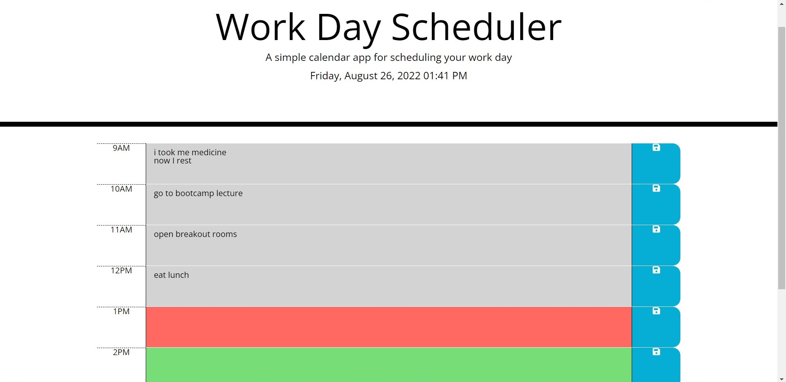

# 05 Third-Party APIs: Work Day Scheduler

## About

This webpage is a Work Day Scheduler that allows the user to put down all of their duties for the day. This webpage is great for people who need to write down their duties for the day and come back to it to update their daily schedule. The header shows the current day, date, and time, while the body of the page loads timeblocks for each hour of the day from 9am to 5pm (normal work hours).

The timeblocks are colored based on the user's computer's time. In the picture above, the current time is 1:41pm so the 1PM block is colored red for present. The blocks after 1PM are colored green for future events, while the blocks before are colored grey for past events.

The user can click on the text area to input their events for the day. However, this doesn't save automatically. If the user wants to save their events, they have to choose the save button to the right of each time block. It will only save the text to the direct left of the save button they click on. This will trigger the program to get their text and save it in local storage. Whenever the page is refreshed, the textarea will remain the same as they left it until they edit/erase the textarea again and save once more!

## Links

Link to GitHub repository: https://github.com/cindyung56/work-day-scheduler

Link to page: https://cindyung56.github.io/work-day-scheduler/

